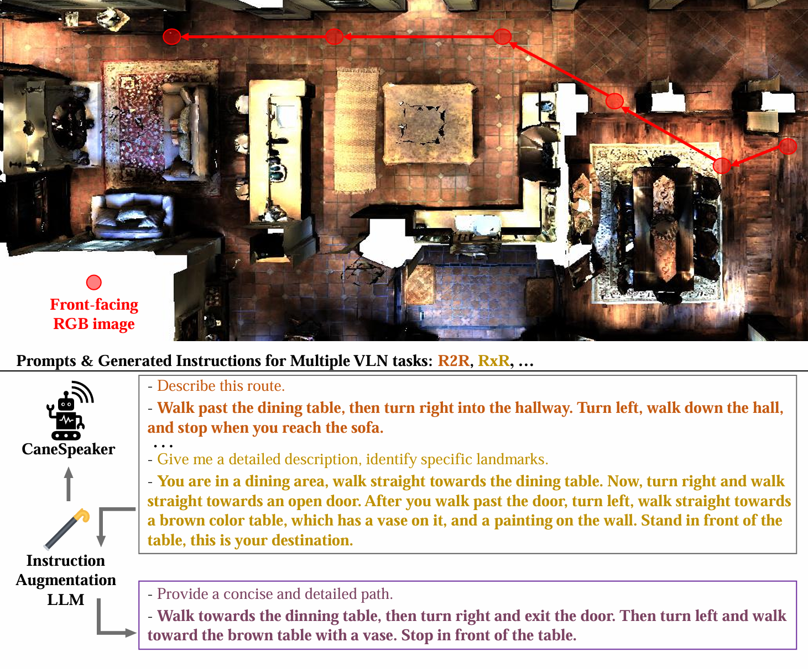

# CaneSpeaker: An LLM-Assisted Speaker for Generating Human-Like Navigation Instructions
We propose a novel Vision-Language Model (VLM)-based speaker, **CaneSpeaker**, to generate human-like instructions from front-facing images for a variety of VLN tasks.




## Requirements

1. Install Matterport3D simulators
  Follow instructions [here](https://github.com/peteanderson80/Matterport3DSimulator).
```
export PYTHONPATH=Matterport3DSimulator/build:$PYTHONPATH
```

2. Data preparation
  Download datasets and processed annotations, including R2R, RxR, REVERIE, SOON, and COCO Captions datasets. Put the data in `task/data' directory. You can also directly the Rx2R and CANE dataset and seamlessly integrate them into your VLN agent training process.(Comming Soon.)


## Run our example

1. Generating Rx2R instructions
```
python ./task/data/gen_Rx2R.py
```
  The program will automatically download the "meta-llama/Llama-3.2-1B-Instruct" from huggingface, and generate the Rx2R dataset.

2. Training and evaluation of CaneSpeaker
```
./task/CaneSpeaker/scripts/warmup.sh

./task/CaneSpeaker/scripts/finetune.sh

./task/CaneSpeaker/scripts/val.sh
```